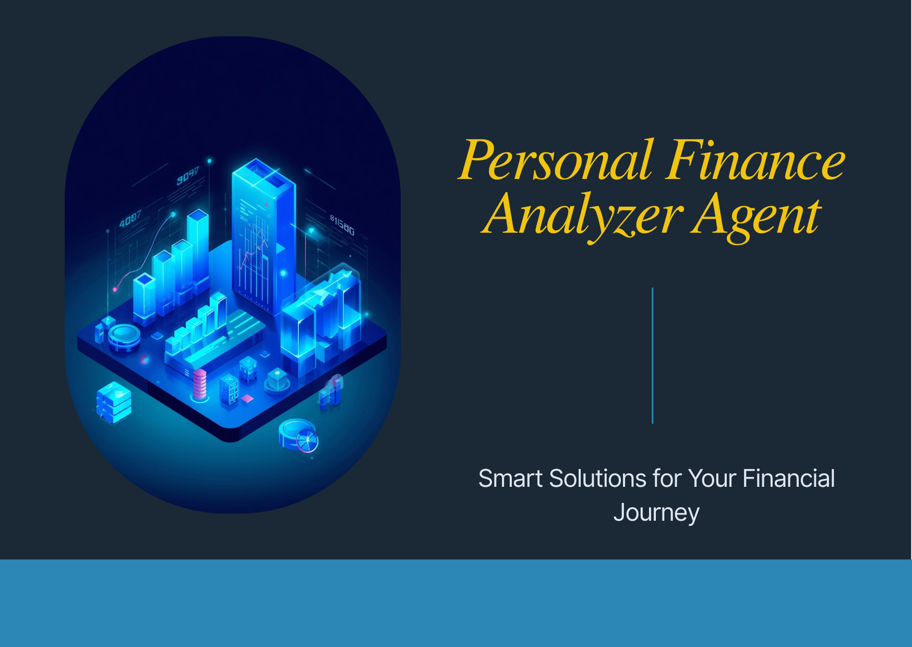

# Personal Finance Analyzer Agent
---


## Overview

The **Personal Finance Analyzer Agent** is an AI-powered multi-agent system for intelligent financial planning.
It helps users:

* Analyze budgets and spending patterns
* Generate debt payoff strategies
* Project investment growth
* Track financial goals over time

---

## Architecture


**Highlights:**

* Root agent orchestrates queries
* 3 specialist sub-agents (Budget, Debt, Investment)
* 8 custom financial tools
* Memory system for goal tracking and history
* Multi-agent design enables parallel processing and specialized reasoning

---
> **Try it live:** [Open in Kaggle Notebook](https://www.kaggle.com/code/shabeeha/personal-finance-analyser) \
> **Watch demo:** [YouTube video](https://youtu.be/wvuzctn4Dio)

## Quick Start

### Option 1: Run on Kaggle (Easiest)

Click the badge to open in Kaggle:

[](https://www.kaggle.com/code/shabeeha/personal-finance-analyser)

### Option 2: Clone & Run Locally

```bash
git clone https://github.com/yourusername/personal-finance-analyzer.git
cd personal-finance-analyzer
# Follow Kaggle notebook instructions to install dependencies and run
```

---

## Features

* Multi-Agent Architecture (Budget, Debt, Investment)
* Custom Tools: Savings, Debt, Investment calculators
* Session Memory: Tracks goals and historical data
* Observability: Logging for all actions and tool calls
* Gemini AI integration for advanced reasoning

---

## Technology Stack

* **Framework:** Google Agent Development Kit (ADK)
* **LLM:** Gemini 2.5 Pro
* **Language:** Python 3.11
* **Environment:** Kaggle Notebooks
* **Libraries:** google-adk, google-genai, logging

---

## License

This project is licensed under the MIT License.
